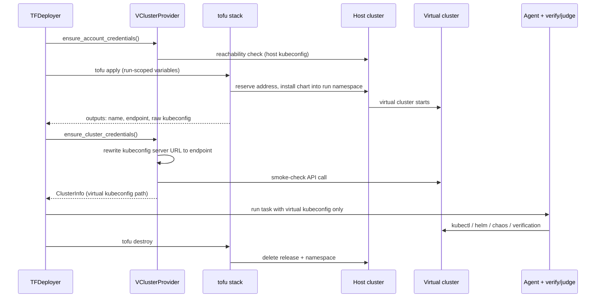

# Design: vCluster Provider

## Problem statement

devops-bench evaluates AI agents on end-to-end DevOps tasks: each eval provisions
infrastructure, runs the agent against it, verifies the outcome, and tears everything down —
so every eval run needs its own Kubernetes cluster. Today we have two options, and both have a
cost/scale problem for parallel matrices:

- **`gcp` (GKE, Google Kubernetes Engine):** realistic but slow (~5–10 min to provision) and
  expensive. A 10× Task × Model matrix means 10 real GKE clusters.
- **`kind`:** free and local, but each cluster is a full control plane in Docker. A laptop — or
  the bastion, the shared cloud VM that runs evals — runs out of memory after a handful of
  concurrent clusters, and startup is still ~1 min each.

[vCluster](https://www.vcluster.com/) (open-source, Apache-2.0) creates *virtual* clusters: each
is a lightweight control plane (a pod) in a namespace of one shared **host cluster**, with
workloads synced to the host's nodes. Startup is seconds, marginal cost is near zero, and dozens coexist on one host — the right
backend for parallel matrices where agents need real `kubectl` access but not real cloud infra.

**Goal:** add `vcluster` as a third provider so a task opts in with one line of `task.yaml`, with
no changes to deployers, agents, verification, or metrics.

## Background: how providers work today

A `Provider` (`devops_bench/providers/base.py`) is a three-method abstract base class.
Provisioning and teardown
are *not* its job — `TFDeployer` does both by running an OpenTofu stack under `tf/prebuilt/`; the
provider only supplies credentials and variable defaults:

| Method | Responsibility |
| --- | --- |
| `ensure_account_credentials()` | Make account-level identity usable (idempotent). `gcp` assumes ambient Application Default Credentials (ADC, gcloud's standard auth); `kind` is a no-op. |
| `resolve_variables(ctx, custom_variables)` | Fill provider-default tofu variables (cluster name, location, kubeconfig path, …) before `tofu apply`. Task variables always win. |
| `ensure_cluster_credentials(cluster_name, location, variables)` | After `tofu apply`, make the cluster reachable and return a `ClusterInfo` (name, location, project, kubeconfig path). `gcp` runs `gcloud container clusters get-credentials`; `kind` points at the kubeconfig the stack wrote. |

Providers self-register in the `PROVIDERS` registry; `deployers/factory.py::_select_provider`
picks one from `task.yaml`'s `provider` key, the `CLOUD_PROVIDER` env var (renamed to
`INFRA_PROVIDER` by [#159](https://github.com/gke-labs/devops-bench/pull/159), which makes
setting `CLOUD_PROVIDER` a configuration error — this design uses whichever name is live at
implementation time), or a substring match on the stack name. Downstream, the pipeline only ever sees `ClusterInfo.kubeconfig_path` — that
handoff surface is why a new provider needs no changes elsewhere.

### How vCluster differs

- **It provisions *into* a cluster, not a cloud account.** Where `gcp` needs a project and
  `kind` a Docker daemon, vCluster's prerequisite is an existing Kubernetes cluster to host the
  virtual ones (any conformant cluster — a local kind cluster, a managed cloud one) and a
  *kubeconfig* for it: the standard credentials-plus-endpoint file `kubectl` uses to talk to a
  cluster.
- **Two kubeconfigs are in play:** the host's (input, stack-only) and the virtual cluster's
  (output, the one agents get). Downstream code must never see the host kubeconfig, or an agent
  could escape its sandbox.
- **Its API endpoint isn't reachable by default** — it lives inside the host cluster and must be
  deliberately exposed (see below), unlike GKE/kind endpoints.
- **Teardown is one namespace delete** on the host — cheap, atomic, easy to garbage-collect.

## Design

### New provider: `providers/vcluster.py`

Register `VClusterProvider` under `"vcluster"` in `PROVIDERS`:

- **`ensure_account_credentials`** — verify the host kubeconfig exists and the host API server
  responds; fail fast with an actionable error. No cloud identity involved.
- **`resolve_variables`** — defaults, mirroring the `kind` provider:
  `host_kubeconfig_path` (`HOST_KUBECONFIG` env, else `~/.kube/config`),
  `cluster_name` (the vcluster name, from `ctx.cluster_name` — already run-scoped),
  `namespace` (derived from `cluster_name`; one per vcluster),
  `kubeconfig_path` (run-scoped output path for the *virtual* kubeconfig),
  `service_type` (`NodePort` \| `LoadBalancer`, default `NodePort`), `location` (`"local"`).
- **`ensure_cluster_credentials`** — take the stack's outputs (raw exported kubeconfig +
  external endpoint), rewrite the kubeconfig's server URL to the endpoint, write it to
  `kubeconfig_path`, and smoke-check it with one trivial API call — mirroring
  `gcloud get-credentials` on `gcp`; YAML rewriting belongs in Python, not OpenTofu. Returns a
  `ClusterInfo` with the host-cluster identifier as project and `"local"` as location — reusing
  `kind`'s existing convention for anything that is not a real cloud endpoint, so
  location-keyed branches (e.g. [#159](https://github.com/gke-labs/devops-bench/pull/159)'s
  skip of LoadBalancer IP resolution when `location == "local"`) treat vclusters correctly.
  The endpoint is already fully resolved here, so no downstream resolution should ever run.

### New stack: `tf/prebuilt/vcluster/`

An OpenTofu stack that installs the vcluster Helm chart (version pinned) into the run-scoped host
namespace. A Helm chart is a packaged, parameterizable bundle of Kubernetes manifests; it is
vCluster's official install method, and driving it from tofu rather than the `vcluster` CLI keeps
the deployer untouched and gives create/destroy symmetry, state tracking, and per-run isolation
for free.

- **Inputs:** the variables above. **Outputs:** `cluster_name` and `cluster_location` (matching
  what `TFDeployer.get_cluster_info()` already parses), plus the raw exported kubeconfig (marked
  sensitive — it's a credential) and the external endpoint.
- **Hardening:** vcluster state lives on ephemeral storage rather than a PersistentVolumeClaim —
  a PVC asks the host to provision durable disk, which silently hangs if the host has no working
  storage provisioner, and eval state doesn't need to survive a pod restart anyway. The stack
  also creates a
  `ResourceQuota` + `LimitRange` in the namespace so one runaway agent workload can't starve the
  host and fail every sibling run.
- **Teardown:** `tofu destroy` removes the release and namespace — that's all of it.

**Reaching the virtual cluster** is the one genuinely new problem.

*The problem:* the vcluster's API server is a pod, and the kubeconfig it exports points at an
address that only resolves *inside* the host cluster — from the machine running the eval,
`kubectl` can't connect at all. And even given a reachable address, the API server's TLS
certificate must list that address among its Subject Alternative Names (SANs — the addresses a
certificate is valid for), or `kubectl` rejects the connection as insecure. The SANs are baked
in at install time, which is awkward for a cloud `LoadBalancer` whose IP is normally assigned
*after* install — a chicken-and-egg.

*The solution*, all at install time, in one `tofu apply`:

1. Determine the external address *before* installing: on a cloud host, reserve a static IP (so
   the LoadBalancer IP is known upfront, breaking the chicken-and-egg); on a local host, use the
   node's own address, which is already known.
2. Install the chart with that address wired into both the exposure Service — `NodePort` (a port
   on the host's node) locally, `LoadBalancer` (a dedicated external IP) on the bastion, chosen
   by the explicit `service_type` variable — and the certificate's SANs.
3. The provider then rewrites the exported kubeconfig's server URL to that same address
   (`ensure_cluster_credentials`, above), and `kubectl` works from anywhere.

Two shortcuts were rejected: a persistent `vcluster connect` port-forward (a long-lived process
the harness would have to babysit, breaking create/destroy symmetry) and
`insecure-skip-tls-verify` (disables certificate checking — a fidelity loss, and a bad habit to
bake into a benchmark).

### Factory

One-line change in `_select_provider`'s substring deduction: check `"vcluster"` before `"kind"`
(so a future `vcluster-kind-host` stack resolves correctly). Task opt-in:

```yaml
infrastructure:
  deployer: tofu
  provider: vcluster        # optional — auto-detected from the stack name
  stack: prebuilt/vcluster
```

### The host cluster

Provisioned out of band, not per eval — the host is standing infrastructure the same way the
bastion VM is: developers use a local kind cluster; the bastion gets one long-lived shared
cluster.

### Parallel safety

The run-scoped `cluster_name` flows into the vcluster name, its host namespace, and the virtual
kubeconfig path, so concurrent runs land in disjoint namespaces. The two host-scoped resources
are handled explicitly: NodePorts are auto-assigned (never pinned); LoadBalancer IPs are
per-service. Sweep rule for `cleanup-orphaned-resources`: any host namespace matching the
vcluster naming prefix with no live run.

## The end-to-end journey

**One-time setup** — have a host cluster and point at it (`HOST_KUBECONFIG`, default
`~/.kube/config`). Locally: `kind create cluster`; on the bastion: the standing shared cluster.
No cloud auth, project, or quota.

**Per run** — the same commands as today (`python -m devops_bench <task.yaml>`, the `run-eval`
and `run-parallel-evals` skills). How the pieces interact over one run:



Provisioning takes ~30–60 s instead of minutes and teardown seconds; the agent sees a normal
empty cluster it fully owns, and a killed run leaves exactly one namespace for the GC
(garbage-collection) sweep.

**At matrix scale** — a matrix of N concurrent runs is N namespaces on one host; the ceiling
becomes host capacity, not quota or provisioning time.

## Implementation plan

1. Manual spike first: stand up one vcluster with `helm` + `kubectl` alone, prove the
   exposure + SAN + kubeconfig-rewrite path end to end, then encode it in the
   `tf/prebuilt/vcluster/` stack (pinned chart, quota/limits, ephemeral storage, outputs).
   Test against a local kind host.
2. `providers/vcluster.py` implementing the three methods (including the kubeconfig rewrite);
   register in `PROVIDERS`. Audit every branch keyed on `ClusterInfo.location` /
   `cluster.location` (including those added by #159) and confirm `"local"` routes a vcluster
   down the intended path.
3. Factory deduction change + a smoke task under `tasks/`; validate with the `validate-eval`
   skill.
4. Unit tests for `resolve_variables` defaults and factory selection; docs-sync; acceptance =
   a Task × Model matrix via `run-parallel-evals` on one shared host with zero collisions.

## Non-goals and risks

- **Not a cloud-provider replacement:** tasks exercising provider-specific features (node
  pools, GPUs, cloud IAM — Identity and Access Management — or specialized storage) still need a
  real cloud provider such as `gcp`. vCluster targets pure-Kubernetes tasks.
- **Fidelity gap:** node objects are virtualized and only a subset of resources sync; webhooks
  and cluster-scoped behaviors can differ. Task authors must confirm verification passes inside a
  vcluster — add a task-review checklist item.
- **Host capacity:** the host is a new shared bottleneck. Per-namespace quotas (above) contain
  any single run; start with a documented concurrency limit sized to host resources.
